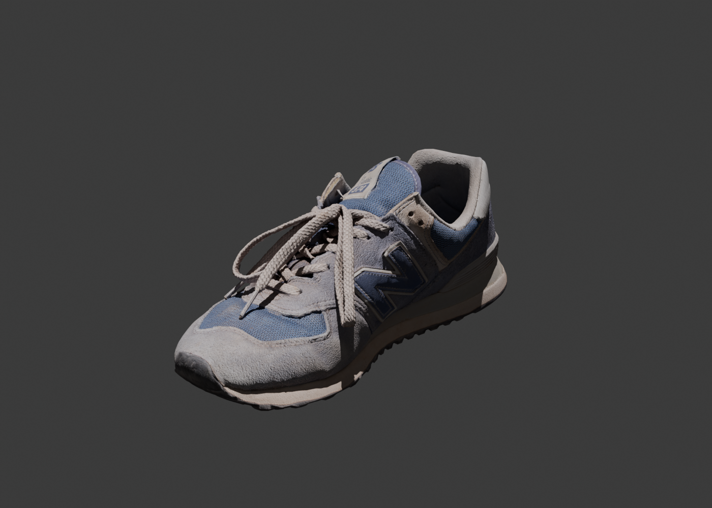
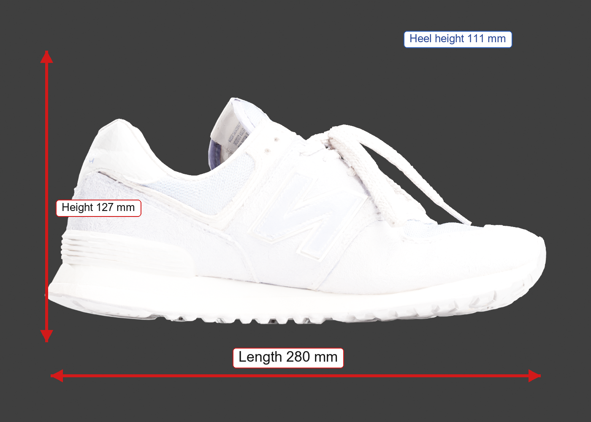

# SoleSpec AI

Converts footwear GLB assets into industrial-style TechPack PDFs with deterministic measurements, validation guardrails, Blender renders, and bounded LangGraph review.

## Final Positioning

This is not a production footwear PLM system.

SoleSpec AI is a factory-facing technical documentation and manufacturing review prototype that converts incomplete footwear GLB assets into industrial-style TechPack artifacts using deterministic geometry extraction, validation guardrails, Blender-based rendering, and bounded LangGraph orchestration.

The system intentionally separates correctness-critical geometric processing from probabilistic AI reasoning in order to preserve measurement reproducibility while still enabling contextual manufacturing review generation.

## Core Architecture Philosophy

Deterministic systems handle correctness-critical geometry, while bounded agentic systems handle orchestration, validation interpretation, and contextual manufacturing reasoning.

## End-to-End Architecture

```text
                         +---------------------------+
                         |      INPUT GLB ASSET      |
                         |  used_new_balance.glb     |
                         +-------------+-------------+
                                       |
                                       v

+--------------------------------------------------------------------+
| 1. GLB INGESTION LAYER                                             |
| ------------------------------------------------------------------ |
| Module: ingestion/glb_loader.py                                    |
|                                                                    |
| Responsibilities:                                                  |
| - Validate GLB                                                     |
| - Load geometry into trimesh.Scene                                 |
| - Parse meshes/material slots                                      |
| - Inspect transforms/UV metadata                                   |
|                                                                    |
| Output: trimesh.Scene                                              |
+--------------------------------------------------------------------+
                                       |
                                       v

+--------------------------------------------------------------------+
| 2. DETERMINISTIC NORMALIZATION PIPELINE                            |
| ------------------------------------------------------------------ |
| Modules:                                                           |
| - normalization/scene_normalizer.py                                |
| - normalization/scale_normalizer.py                                |
|                                                                    |
| Responsibilities:                                                  |
| - Canonical axis alignment                                         |
| - Ground-plane alignment                                           |
| - Centering                                                        |
| - Scale correction                                                 |
|                                                                    |
| Coordinate Convention:                                             |
| X = Length                                                         |
| Y = Height                                                         |
| Z = Width                                                          |
|                                                                    |
| Scale Heuristic: Target shoe length ~= 280 mm                      |
|                                                                    |
| Geometry normalization is deterministic because manufacturing       |
| dimensions must remain reproducible and traceable.                 |
+--------------------------------------------------------------------+
                                       |
                                       v

+--------------------------------------------------------------------+
| 3. GEOMETRY EXTRACTION ENGINE                                      |
| ------------------------------------------------------------------ |
| Modules:                                                           |
| - geometry_engine/footwear_measurements.py                         |
| - geometry_engine/geometry_analyzer.py                             |
|                                                                    |
| Responsibilities:                                                  |
| - Extract shoe dimensions                                          |
| - Bounding-box analysis                                            |
| - Heel height estimation                                           |
| - Sole thickness estimation                                        |
| - Component heuristics                                             |
|                                                                    |
| Outputs: length_mm, width_mm, height_mm, heel_height_mm,           |
| sole_thickness_mm                                                  |
|                                                                    |
| Component extraction is heuristic because input GLBs may lack       |
| semantic footwear segmentation metadata.                           |
+--------------------------------------------------------------------+
                                       |
                                       v

+--------------------------------------------------------------------+
| 4. MATERIAL ANALYSIS LAYER                                         |
| ------------------------------------------------------------------ |
| Module: material_engine/material_analyzer.py                       |
|                                                                    |
| Responsibilities:                                                  |
| - Extract material names                                           |
| - Inspect embedded texture metadata                                |
| - Parse color information                                          |
| - Assign confidence scores                                         |
|                                                                    |
| Missing metadata triggers explicit uncertainty reporting instead    |
| of fabricated material inference.                                  |
+--------------------------------------------------------------------+
                                       |
                                       v

+--------------------------------------------------------------------+
| 5. VALIDATION & GUARDRAIL ENGINE                                   |
| ------------------------------------------------------------------ |
| Module: validation/validation_engine.py                            |
|                                                                    |
| Responsibilities:                                                  |
| - Manufacturing plausibility checks                                |
| - Geometry threshold validation                                    |
| - Segmentation confidence analysis                                 |
| - Material metadata validation                                     |
| - Reliability guardrails                                           |
|                                                                    |
| Example Checks: unrealistic shoe width, abnormal heel height,       |
| thin sole warnings, missing material metadata, low segmentation     |
| confidence                                                         |
|                                                                    |
| Output: structured validation issues                               |
|                                                                    |
| Validation acts as deterministic guardrails before downstream       |
| AI-assisted manufacturing reasoning occurs.                        |
+--------------------------------------------------------------------+
                                       |
                                       v

+--------------------------------------------------------------------+
| 6. BLENDER RENDERING PIPELINE                                      |
| ------------------------------------------------------------------ |
| Module: rendering_engine/blender_renderer.py                       |
|                                                                    |
| Responsibilities:                                                  |
| - Multi-view rendering                                             |
| - PBR texture rendering                                            |
| - Technical visualization                                          |
| - Consistent framing                                               |
|                                                                    |
| Views Generated: perspective, side, top, front, back               |
| Output Folder: outputs/blender_renders/                            |
+--------------------------------------------------------------------+
                                       |
                                       v

+--------------------------------------------------------------------+
| 7. TECHNICAL OVERLAY GENERATION                                    |
| ------------------------------------------------------------------ |
| Modules:                                                           |
| - document_engine/overlay_generator.py                             |
| - document_engine/technical_drawing_generator.py                   |
|                                                                    |
| Responsibilities:                                                  |
| - Dimension arrows                                                 |
| - Technical labels                                                 |
| - Measurement annotations                                          |
| - 2D line-art style technical drawings                             |
| - Factory-style visualization                                      |
|                                                                    |
| Example Overlays: LENGTH = 280 mm, HEEL HEIGHT = 111 mm            |
| Output Folder: outputs/annotated/                                  |
+--------------------------------------------------------------------+
                                       |
                                       v

+--------------------------------------------------------------------+
| 8. CANONICAL TECHPACK SCHEMA                                       |
| ------------------------------------------------------------------ |
| Module: schemas/techpack_schema.py                                 |
|                                                                    |
| Responsibilities:                                                  |
| - Structured manufacturing representation                          |
| - Single source of truth                                           |
| - Validation aggregation                                           |
| - Render metadata                                                  |
| - Measurement storage                                              |
|                                                                    |
| Output: outputs/schemas/techpack_spec.json                         |
+--------------------------------------------------------------------+
                                       |
                                       v

+--------------------------------------------------------------------+
| 9. LANGGRAPH AGENTIC ORCHESTRATION                                 |
| ------------------------------------------------------------------ |
| Modules: agentic/graph.py, agentic/nodes/*.py                      |
|                                                                    |
| Responsibilities:                                                  |
| - Workflow orchestration                                           |
| - Validation interpretation                                        |
| - Manufacturing review                                             |
| - QA commentary                                                    |
|                                                                    |
| LangGraph Flow:                                                    |
| Ingestion -> Normalization -> Geometry -> Validation -> Rendering  |
| -> Manufacturing Review -> PDF Assembly                            |
|                                                                    |
| Agentic reasoning is intentionally bounded and does not generate    |
| geometry-critical measurements.                                    |
+--------------------------------------------------------------------+
                                       |
                                       v

+--------------------------------------------------------------------+
| 10. RAG-GROUNDED MANUFACTURING REVIEW (OPTIONAL EXTENSION)         |
| ------------------------------------------------------------------ |
| Potential Stack: Ollama, LangChain, ChromaDB / FAISS               |
|                                                                    |
| Responsibilities:                                                  |
| - Retrieve manufacturing guidelines                                |
| - Enrich QA commentary                                             |
| - Generate grounded review notes                                   |
|                                                                    |
| RAG is used only for contextual manufacturing reasoning and never   |
| for deterministic geometry extraction.                             |
+--------------------------------------------------------------------+
                                       |
                                       v

+--------------------------------------------------------------------+
| 11. INDUSTRIAL-STYLE PDF GENERATION                                |
| ------------------------------------------------------------------ |
| Module: document_engine/pdf_composer.py                            |
|                                                                    |
| Final Outputs:                                                     |
| - cover_sheet.pdf                                                  |
| - measurement_sheet.pdf                                            |
| - bom_colorway_sheet.pdf                                           |
| - validation_report.pdf                                            |
|                                                                    |
| Features: multi-view renders, measurement overlays, revision        |
| blocks, validation warnings, confidence reporting, manufacturing    |
| notes, explicit limitations                                        |
+--------------------------------------------------------------------+
                                       |
                                       v

                    +--------------------------------+
                    | FINAL FACTORY-FACING OUTPUTS   |
                    | ------------------------------ |
                    | - Industrial-style PDFs        |
                    | - Structured schema            |
                    | - Validation artifacts         |
                    | - Manufacturing review         |
                    +--------------------------------+
```

## Design Principles

1. Deterministic geometry over probabilistic measurement inference.
2. Explicit uncertainty reporting over hidden assumptions.
3. Validation before downstream manufacturing reasoning.
4. Bounded AI orchestration instead of autonomous generation.
5. Structured schema as the single source of truth.

## Outputs

The repository includes generated TechPacks for all three supplied GLB inputs:

| Input asset | Generated output folder |
| --- | --- |
| `used_new_balance_574_classic______free.glb` | [outputs/samples/used_new_balance_574_classic______free/techpacks](outputs/samples/used_new_balance_574_classic______free/techpacks) |
| `flower_sneakers_shoe_scan.glb` | [outputs/samples/flower_sneakers_shoe_scan/techpacks](outputs/samples/flower_sneakers_shoe_scan/techpacks) |
| `miles_morales_shoes.glb` | [outputs/samples/miles_morales_shoes/techpacks](outputs/samples/miles_morales_shoes/techpacks) |

Each sample folder contains:

- `cover_sheet.pdf`
- `measurement_sheet.pdf`
- `technical_drawing_sheet.pdf`
- `bom_colorway_sheet.pdf`
- `validation_report.pdf`
- `schemas/techpack_spec.json`
- `schemas/run_manifest.json`

The top-level [outputs/techpacks](outputs/techpacks) folder is kept as the primary single-sample preview for the New Balance input.

## Visual Outputs

### Color Blender Render



The TechPack PDFs use color render views for product reference. The black-and-white drawings are included separately as the 2D technical drawing capability.

### Measurement Overlay



### Multi-Asset Validation

The validation engine produces different manufacturing concerns depending on the geometry and metadata quality of each GLB asset. The generated report for each input is stored in that input's `outputs/samples/<asset>/techpacks/validation_report.pdf` folder.

| Asset | Observed Behavior |
| --- | --- |
| Original / New Balance GLB | Heel, material, and segmentation warnings |
| Flower Sneaker | Heel-height and thin-sole warnings |
| Miles Morales Shoe | Material metadata and segmentation warnings |

## End-to-End Pipeline

```text
Input GLB
   |
   v
1. GLB Ingestion
   |
   v
2. Scene Normalization
   |
   v
3. Scale Normalization
   |
   v
4. Geometry & Measurement Extraction
   |
   v
5. Component / Material Heuristics
   |
   v
6. Validation Engine
   |
   v
7. Blender Multi-View Rendering
   |
   v
8. Measurement Overlay Generation
   |
   v
9. Canonical TechPack Schema
   |
   v
10. LangGraph Agentic Review
   |
   v
11. PDF Generation
   |
   v
Final TechPack Outputs
```

### 1. GLB Ingestion

Module: `ingestion/glb_loader.py`

Loads the `.glb` model and validates that geometry exists.

```text
Input: input/shoe.glb
Output: trimesh.Scene
```

Purpose:

- Load 3D footwear asset.
- Validate file type.
- Extract mesh geometry.
- Preserve material and visual metadata where available.

### 2. Scene Normalization

Module: `normalization/scene_normalizer.py`

Converts arbitrary GLB coordinate systems into a canonical footwear coordinate system.

```text
X = length
Y = height
Z = width
```

Purpose:

- Center model.
- Align dominant axis.
- Move bottom to ground plane.
- Standardize orientation for downstream measurements and rendering.

### 3. Scale Normalization

Module: `normalization/scale_normalizer.py`

Handles missing or unreliable GLB unit metadata.

Purpose:

- Detect implausible dimensions.
- Rescale asset to plausible footwear length.
- Default target length: `280 mm`.
- Store scale assumption metadata.

Example:

```text
Original assumed length: 8182.91 mm
Applied target length: 280 mm
```

### 4. Geometry & Measurement Extraction

Module: `geometry_engine/footwear_measurements.py`

Extracts deterministic manufacturing measurements from transformed geometry.

Measurements:

- Length.
- Width.
- Height.
- Heel height.
- Sole thickness.

Example output:

```json
{
  "length_mm": 280.0,
  "width_mm": 112.2,
  "height_mm": 126.53,
  "heel_height_mm": 110.94,
  "sole_thickness_mm": 12.6
}
```

Key principle:

```text
Geometry is deterministic because manufacturing dimensions must be reproducible.
```

### 5. Component / Material Heuristics

Modules:

- `geometry_engine/geometry_analyzer.py`
- `material_engine/material_analyzer.py`

Purpose:

- Extract mesh and component metadata.
- Infer available material information.
- Assign confidence scores.
- Fall back safely when model is monolithic.

Important limitation:

```text
If the GLB contains only Object_0/material_0, the system does not fake full footwear segmentation.
```

### 6. Validation Engine

Module: `validation/validation_engine.py`

Runs deterministic manufacturing plausibility checks.

Checks:

- Shoe length range.
- Shoe width range.
- Heel height warning.
- Sole thickness warning.
- Low component confidence.
- Missing material metadata.

Example output:

```json
[
  {
    "severity": "medium",
    "category": "geometry",
    "message": "Heel height unusually high for casual footwear."
  }
]
```

Purpose:

- Catch implausible outputs.
- Surface uncertainty.
- Act as guardrail before AI reasoning.

### 7. Blender Multi-View Rendering

Module: `rendering_engine/blender_renderer.py`

Uses Blender because it handles GLB/PBR textures more reliably than lightweight geometry libraries.

Views generated:

- Perspective.
- Side.
- Top.
- Front.
- Back.

Output:

```text
outputs/blender_renders/
|-- perspective.png
|-- side.png
|-- top.png
|-- front.png
`-- back.png
```

### 8. Measurement Overlay and 2D Technical Drawing Generation

Modules:

- `document_engine/overlay_generator.py`
- `document_engine/technical_drawing_generator.py`

Adds technical annotations and line-art style drawing references to rendered views.

Examples:

- Length arrow.
- Height arrow.
- Heel height label.
- Measurement labels in mm.
- Side/top/front line-art drawing references.
- 2D technical drawing PDF sheet.

Output:

```text
outputs/annotated/
`-- side_annotated.png
outputs/technical_drawings/
|-- side_technical_drawing.png
|-- top_technical_drawing.png
`-- front_technical_drawing.png
```

Purpose:

- Make generated documents look like technical manufacturing references.
- Improve factory readability.
- Demonstrate the 2D technical drawing capability without claiming CAD-grade pattern generation.

### 9. Canonical TechPack Schema

Module: `schemas/techpack_schema.py`

Stores all extracted information in one structured schema.

Output:

```text
outputs/schemas/techpack_spec.json
```

Schema contains:

- Metadata.
- Normalization metadata.
- Measurements.
- Components.
- Materials with RGB/hex palette, color source, and confidence.
- Retrieval-grounded manufacturing evidence.
- AI review confidence scores.
- Run manifest / audit metadata.
- Renders.
- Validation issues.
- Manufacturing notes.

This is the single source of truth.

### 10. LangGraph Agentic Review

Modules:

- `agentic/graph.py`
- `agentic/nodes/manufacturing_review_node.py`

Purpose:

- Orchestrate workflow.
- Review validation outputs.
- Generate bounded manufacturing/QA commentary.

Important boundary:

```text
LLM/agentic reasoning does not generate measurements.
It only interprets validated deterministic outputs.
```

### 11. PDF Generation

Module: `document_engine/pdf_composer.py`

Generates a set of factory-facing PDFs.

Final outputs:

```text
outputs/techpacks/
|-- cover_sheet.pdf
|-- measurement_sheet.pdf
|-- technical_drawing_sheet.pdf
|-- bom_colorway_sheet.pdf
`-- validation_report.pdf
```

PDFs include:

- Render previews.
- Revision block.
- Measurement tables.
- Annotated views.
- BOM and material summary.
- Confidence notes.
- Assumptions.
- Validation warnings.

## Deterministic vs Agentic Split

| Deterministic Systems | Agentic / Reasoning Systems |
| --- | --- |
| GLB loading and validation | Workflow orchestration |
| Scene and scale normalization | Manufacturing review |
| Geometry measurements | Validation interpretation |
| Component heuristics | QA-oriented commentary |
| Blender rendering | Report assembly coordination |
| Rule-based validation |  |

## Structured Schema Layer

`outputs/schemas/techpack_spec.json` is the canonical manufacturing representation. The PDFs, overlays, validation report, and manufacturing notes derive from this structured schema.

## Validation Philosophy

Validation rules are heuristic manufacturing plausibility checks rather than factory-certified specification constraints. They are intended to surface suspicious dimensions, missing metadata, and extraction uncertainty before downstream manufacturing review.

## Domain Scope

The infrastructure pipeline is mostly domain-agnostic: load asset, normalize, analyze, validate, render, assemble documents. The semantic extraction and validation logic are currently specialized for footwear.

## System Quality

SoleSpec AI should be understood as a credible AI-assisted technical documentation prototype, not a production footwear PLM platform. Its strongest architectural choice is the separation between deterministic systems and agentic systems: measurements, scaling, validation, and rendering are deterministic; LangGraph is used for orchestration and bounded review.

The pipeline was shaped around real GLB constraints: coordinate ambiguity, scale ambiguity, missing metadata, monolithic geometry, rendering reliability, and uncertainty handling. This makes the architecture more believable than a demo that assumes clean CAD inputs.

## Setup

Download or clone the full repository before running the demo. `run_demo.ps1` is only a helper script; it will not run by itself if downloaded alone because it depends on `agentic_main.py`, the `src/` package, the `input/` GLB assets, and the installed Python environment.

Recommended GitHub setup:

```powershell
git clone https://github.com/srivatsavagade/solespec-ai.git
cd solespec-ai
git lfs pull
```

The input `.glb` files are stored with Git LFS. If the repo is downloaded as a ZIP or cloned without LFS, the GLB files may be tiny pointer files instead of real 3D assets, and the pipeline will fail during loading/rendering.

Use Python 3.10 for the project environment. Some rendering/test dependencies are not available for the accidental Python 3.14 virtualenv path on Windows yet.

```powershell
py -3.10 -m venv .venv310
.venv310\Scripts\activate
pip install -r requirements.txt
```

Blender is required for final renders. The renderer resolves Blender in this order:

```text
1. Explicit path passed to BlenderRenderer
2. BLENDER_EXECUTABLE environment variable
3. blender available on PATH
```

On Windows, if Blender is not on PATH:

```powershell
$env:BLENDER_EXECUTABLE="C:\Program Files\Blender Foundation\Blender 5.1\blender.exe"
```

## Run

Place the input model at:

```text
input/used_new_balance_574_classic______free.glb
```

Run the LangGraph-orchestrated version:

```bash
python -B agentic_main.py --input input/used_new_balance_574_classic______free.glb --output outputs
```

To apply human-reviewed component or material corrections before validation and PDF generation:

```bash
python -B agentic_main.py --input input/used_new_balance_574_classic______free.glb --output outputs --review-overrides configs/review_overrides.example.json
```

Review overrides are JSON files that match extracted components by `mesh_name` and materials by `name`. This lets a reviewer correct labels such as `unknown_component` to `upper`, raise confidence after inspection, or replace generic material names with factory-facing labels while keeping the original automated extraction path intact.

Or use the Windows demo helper after completing the setup above:

```powershell
.\run_demo.ps1
```

The helper runs all three included GLB inputs and writes each result to `outputs/samples/<asset-name>/`. Expected runtime is roughly 5-7 minutes on a laptop, mostly spent in Blender rendering.

The pipeline exports a normalized intermediate GLB before rendering:

```text
outputs/intermediate/<model>_normalized.glb
```

This keeps the rendered views aligned with the normalized measurements used in the PDFs.

The validation report also includes a method-and-assumptions block covering unit assumptions, scale normalization, component extraction limits, and factory verification guidance.

## AI / ML Engineering Layer

The system includes a bounded AI review layer on top of deterministic 3D extraction:

- `manufacturing_ai/knowledge_retriever.py` builds a TF-IDF retrieval index over local footwear manufacturing guidelines.
- Validation issues, measurements, materials, and component signals are converted into a retrieval query.
- Retrieved guideline IDs and scores are persisted into the schema and run manifest for auditability.
- `manufacturing_ai/confidence_scorer.py` computes geometry, material, component, and factory-readiness confidence scores from extraction quality and validation severity.
- `schemas/run_manifest.json` records input, seed, environment, selected capabilities, normalization metadata, confidence scores, outputs, and warning counts.

This keeps production-critical geometry deterministic while using ML-style retrieval and confidence scoring for contextual manufacturing review.

## Output Structure

```text
outputs/
|-- samples/
|   |-- used_new_balance_574_classic______free/
|   |-- flower_sneakers_shoe_scan/
|   `-- miles_morales_shoes/
|       |-- blender_renders/
|       |-- annotated/
|       |-- technical_drawings/
|       |-- schemas/
|       `-- techpacks/
|           |-- cover_sheet.pdf
|           |-- measurement_sheet.pdf
|           |-- technical_drawing_sheet.pdf
|           |-- bom_colorway_sheet.pdf
|           `-- validation_report.pdf
|-- intermediate/
|   `-- <model>_normalized.glb
|-- blender_renders/
|   |-- render.png
|   |-- perspective.png
|   |-- side.png
|   |-- top.png
|   |-- front.png
|   `-- back.png
|-- annotated/
|   `-- side_measurements.png
|-- technical_drawings/
|   |-- side_technical_drawing.png
|   |-- top_technical_drawing.png
|   `-- front_technical_drawing.png
|-- schemas/
|   `-- techpack_spec.json
|   `-- run_manifest.json
`-- techpacks/
    |-- cover_sheet.pdf
    |-- measurement_sheet.pdf
    |-- technical_drawing_sheet.pdf
    |-- bom_colorway_sheet.pdf
    `-- validation_report.pdf
```

## Explicit Limitations

- Semantic component extraction is heuristic. The system uses bounding boxes, spatial inference, confidence scoring, and monolithic mesh fallback rather than true semantic footwear decomposition.
- Material intelligence is metadata-based and fallback-heavy. It does not yet perform texture understanding, material classification, or supplier-aware material reasoning.
- Validation rules are plausibility heuristics, not factory-certified tolerances, production standards, or learned constraints from domain datasets.
- Scale normalization uses a practical `280 mm` footwear-length prior when GLB units are missing or implausible. This is useful, but it remains an explicit assumption.
- The LangGraph layer is intentionally lightweight. It provides structured orchestration and bounded manufacturing review, not autonomous production decision-making.
- Extracted dimensions are suitable for technical review and documentation, but should be verified against source CAD, physical samples, or factory measurement standards before production use.
- Generated 2D technical drawings are line-art references derived from Blender views, not CAD-grade outsole drawings or upper pattern files.
- Human review overrides improve labels and BOM readability, but they are reviewer assertions rather than proof of factory-ready construction.

## Quick Checks

The project includes lightweight unit checks for geometry and renderer configuration paths:

```bash
python -B -m unittest discover -s tests -v
```

These tests do not run Blender. Full end-to-end verification is the CLI run above because the final artifacts depend on Blender rendering.

## Multi-Model Smoke Coverage

The project includes generated outputs for more than one shoe-like GLB:

```text
outputs/
outputs_flower_sneakers_shoe_scan/
outputs_miles_morales_shoes/
```

These are included to show that validation findings and extracted metadata vary by input rather than coming from a static template.

## Future Work

- Expand automated regression coverage across multiple shoe GLBs.
- Add a dedicated normalization metadata section to the PDF cover sheet.
- Improve material extraction from embedded PBR texture maps.
- Expand the human review layer with a small UI for component/material correction.
- Add component segmentation only when source topology, node hierarchy, or material assignments support it.
